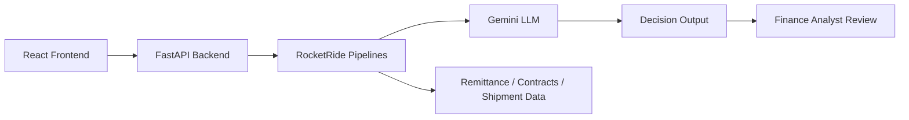

# Deduction Defender

A RocketRide-powered AI prototype for retail deduction review and dispute management.

## Problem statement

Consumer brand finance teams lose a meaningful share of revenue to retailer chargebacks and unauthorized deductions. These deductions often appear as reductions to payments after merchandise has already been shipped, sold, or reconciled. In practice, the finance team must manually review remittance files, promotion agreements, shipment data, and retailer compliance manuals to determine whether each deduction is valid, invalid, or needs analyst review.

The image highlights a concrete business pain point:

- For consumer brand finance teams, losing 1–2% of revenue to retailer chargebacks and unauthorized deductions is common.
- These deductions are often hidden inside payment remittances, promotion contracts, and shipment records.
- The review process is high-volume and repetitive, making it expensive and slow when handled manually.
- Each deduction must be compared against the actual retailer agreement, policy terms, and evidence attached to the shipment or promotion.
- Some deductions are legitimate, but many are invalid or unsupported.
- Companies must decide whether to dispute the deduction, accept it, or escalate it for specialist approval.

This problem is especially difficult because the finance team is often balancing several information sources at once:

- retailer payment remittance files
- promotional allowance agreements
- shipment and fulfillment records
- compliance manuals and contract terms
- historical deduction records and proof documents

A wrong decision can either cause revenue leakage or create unnecessary disputes. The result is a slow manual process with a high risk of missed recoveries and excessive analyst effort.

## Why this project matters

The goal of Deduction Defender is to automate the early-stage review of deductions by:

- identifying deduction type and amount
- checking whether the deduction matches the retailer agreement or policy
- comparing against shipment and remittance evidence
- flagging invalid deductions that should be disputed
- recommending valid deductions for write-off or approval
- escalating high-value or borderline cases to human analysts

This helps finance teams recover revenue faster, reduce manual effort, and improve consistency in review decisions.

## Project goals

This prototype demonstrates how an AI workflow can support the deduction review process by combining:

- retailer deduction data
- remittance context
- contract and promotion policy context
- shipment evidence
- Gemini-powered reasoning for analysis and recommendation

The app is designed to behave like an analyst assistant, not a fully production-grade financial system.

## Solution approach

This project uses RocketRide pipelines to create an AI review workflow:

1. A user enters a deduction question or uploads relevant evidence.
2. The pipeline sends the content through a prompt layer that gives the model precise instructions.
3. Gemini analyzes the deduction in relation to contract, remittance, and shipment evidence.
4. The output classifies the deduction as:
   - valid
   - invalid
   - needs analyst review
5. The response includes an explanation, supporting evidence, and recommended next action.

## RocketRide pipelines included

- `deduction_defender_chat.pipe` — conversational analyst workflow for reviewing specific deduction cases
- `deduction_defender_upload.pipe` — file-based workflow for uploaded remittance or agreement content

## Tech stack

- Frontend: React
- Backend: FastAPI
- AI orchestration: RocketRide pipelines
- LLM: Gemini

## Project folder structure

```text
DeductionDefender/
├── README.md
├── check.py
├── deduction_defender_chat.pipe
├── deduction_defender_upload.pipe
├── env.example
├── backend/
│   ├── app.py
│   ├── requirements.txt
│   └── .env.example
├── frontend/
│   ├── package.json
│   ├── vite.config.js
│   └── src/
└── .gitignore
```

## Setup

### 1. Backend configuration

Create a `.env` file in the backend folder based on the example:

```bash
cd Projects/DeductionDefender/backend
copy .env.example .env
```

Then fill in your values:

```env
ROCKETRIDE_URI=https://api.rocketride.ai
ROCKETRIDE_APIKEY=your_rocketride_api_key
ROCKETRIDE_GEMINI_KEY=your_gemini_api_key
```

### 2. Create and activate the backend virtual environment

From the backend folder:

```bash
cd Projects/DeductionDefender/backend
python -m venv .venv
.venv\Scripts\activate
```

After activation, your terminal prompt should show the virtual environment name, such as `(.venv)`.

### 3. Install backend dependencies

```bash
pip install -r requirements.txt
```

### 4. Install frontend dependencies

```bash
cd ../frontend
npm install
```

### 5. Run the backend

From the backend folder, with the virtual environment still active:

```bash
uvicorn app:app --reload --host 0.0.0.0 --port 8000
```

This starts the FastAPI server on:

```text
http://localhost:8000
```

### 6. Run the frontend

Open a new terminal and run:

```bash
cd Projects/DeductionDefender/frontend
npm run dev
```

Then open:

```text
http://localhost:5173
```

Open the frontend at:

```text
http://localhost:5173
```

## Architecture overview

The project follows a simple but practical architecture for finance workflow automation:



The architecture diagrams are available in the separate folder:

- [architectures/deduction_defender_system_architecture.jpg](architectures/deduction_defender_system_architecture.jpg)
- [architectures/rocketride_pipeline_architecture.jpg](architectures/rocketride_pipeline_architecture.jpg)

## Production-style summary

This prototype is designed to demonstrate a business-ready decision workflow for deduction operations. It supports the core operations a finance team needs:

- review deduction claims quickly
- compare documentation with remittance and contract data
- prepare a case for dispute or write-off
- escalate exceptions for human validation
- reduce manual review time and improve recovery rates

The result is a lightweight, AI-enabled operations dashboard that mirrors how a modern accounts-receivable or retail finance team might review deductions before escalation.

## Validation

The project includes a validation script:

```bash
python check.py
```

This checks that the RocketRide pipeline files are valid JSON and match the required structure.

## Important note

This is a prototype for product demonstration and technical validation. It is not a full production finance system, regulatory workflow, or enterprise compliance engine. It is meant to show how AI and RocketRide can help solve the deduction review problem in a realistic, operationally meaningful way.
